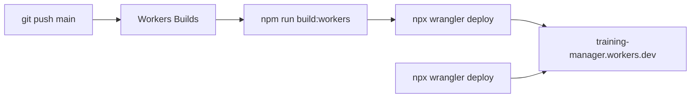

# Pierwsze wdrożenie na Cloudflare Workers

Platforma: **Cloudflare Workers** ([context/foundation/infrastructure.md](../../foundation/infrastructure.md)). Stack: Astro 7 SSR + `@astrojs/cloudflare` 14.3 + Wrangler 4 ([context/foundation/tech-stack.md](../../foundation/tech-stack.md)). **Nie** Pages — adapter v14 tego nie obsługuje.

Auto-deploy na `main` robi **Workers Builds** (integracja Git Cloudflare), nie GitHub Actions. Istniejący [`.github/workflows/ci.yml`](../../../.github/workflows/ci.yml) zostaje bez zmian: lint / `astro check` / build / smoke. Żadnego joba `deploy`.

Hostowany Supabase jest podpięty do Workera (`wrangler secret put`). Baner „Supabase nie jest skonfigurowany” na `https://training-manager.grzegorz-b5b.workers.dev` zniknął.

Lokalny branch to `main`, remote to `origin` (`gmaszkiewicz/training-manager`). Pierwszy commit jest na GitHubie. Worker: `https://training-manager.grzegorz-b5b.workers.dev`.

## Status

- [x] Przygotowanie repo (nazwa Workera, `npm run deploy`, docs)
- [x] `npx wrangler login` / `whoami`
- [x] Pliki `.env` i `.dev.vars` w katalogu projektu
- [x] Lokalny Docker Supabase — pominięty; dev używa hostowanego projektu w `.env` i `.dev.vars`
- [x] Pierwszy `npm run deploy` — `https://training-manager.grzegorz-b5b.workers.dev`
- [x] Auto Minify — opcji nie ma w dashboardzie; na `*.workers.dev` nie dotyczy
- [x] Pierwszy commit i `git push -u origin main`
- [x] Zmienna builda `NODE_VERSION=22` (Settings → Builds → Build variables and secrets)
- [x] Workers Builds na `main` — wersja `95e71a29-08fe-4866-af11-7e6bcd924a4f` z pusha `Init auto-deploy`
- [x] Hostowany Supabase + `wrangler secret put` — baner konfiguracji zniknął
- [x] Smoke logowania na `https://training-manager.grzegorz-b5b.workers.dev/auth/signin`



## 1. Przygotowanie repo (agent) — zrobione

- W [wrangler.jsonc](../../../wrangler.jsonc) zmienić `"name": "10x-astro-starter"` na `"training-manager"` — nazwa dashboardu i `name` w Wranglerze **muszą być identyczne**, inaczej Builds pada.
- W [package.json](../../../package.json) zmienić `name` na `training-manager` i dodać skrypt `deploy`: `npm run build && wrangler deploy` (lokalny/ręczny deploy; Builds użyje wranglera z `devDependencies`).
- W [context/foundation/tech-stack.md](../../foundation/tech-stack.md) poprawić stale `deployment_target: cloudflare-pages` → `cloudflare-workers`.
- Zaktualizować sekcje Deployment / CI w [README.md](../../../README.md) i [CLAUDE.md](../../../CLAUDE.md): produkcja = `npx wrangler deploy`; auto-deploy = Workers Builds na `main`; GHA tylko quality gate.

Nie ruszać `main: "@astrojs/cloudflare/entrypoints/server"` ani `compatibility_flags: ["nodejs_compat"]`.

## 2. Konfiguracja Wrangler CLI (Ty) — login zrobiony, sekrety po hostowanym Supabase

Wrangler jest w `devDependencies` (`^4.131.1`). Nie instaluj drugiej, globalnej kopii.

W katalogu projektu:

```powershell
npx wrangler login
npx wrangler whoami
```

`login` otwiera przeglądarkę i zapisuje sesję lokalnie. To wystarczy do ręcznego `npx wrangler deploy`.

Auto-deploy na `main` idzie przez Workers Builds. Builds sam tworzy token API. `CLOUDFLARE_API_TOKEN` w GitHubie nie jest potrzebny.

Sekrety runtime wstawiasz dopiero po utworzeniu hostowanego projektu Supabase (sekcja 3). Komenda pyta o wartość w terminalu — nie podawaj jej jako argumentu. `secret put` od razu publikuje nową wersję Workera. Wartości nie trafiają do `wrangler.jsonc` ani do gita.

```powershell
npx wrangler secret put SUPABASE_URL
npx wrangler secret put SUPABASE_KEY
```

## 3. Konfiguracja Supabase

Dwa osobne środowiska. Adres `127.0.0.1` z lokalnego Dockera nie działa na Workers.

### Lokalnie (dev) — pliki utworzone, stack Supabase jeszcze nie uruchomiony

Folder `supabase/` już istnieje, więc `npx supabase init` nie jest potrzebny. Potrzebny jest Docker.

```powershell
npx supabase start
npx supabase status
```

Z wyjścia weź `API URL` i klucz **anon**, potem skopiuj `.env.example` do `.env` i `.dev.vars`:

```
SUPABASE_URL=http://127.0.0.1:54321
SUPABASE_KEY=<anon key>
```

Oba pliki są w `.gitignore`. `.dev.vars` czyta `npm run dev` (workerd). `.env` czyta tooling Node. Zatrzymanie: `npx supabase stop`.

### Hostowany projekt (Worker)

Po pierwszym deployu, gdy znasz URL `*.workers.dev`:

1. Utwórz projekt na [supabase.com](https://supabase.com).
2. W **Project Settings → API** skopiuj Project URL i klucz **anon** (publishable). Nie używaj `service_role`.
3. W **Authentication → URL Configuration** ustaw Site URL na adres Workera, na przykład `https://training-manager.<konto>.workers.dev`, i dodaj ten sam origin do Redirect URLs. Potwierdzenie maila wraca na Site URL.
4. Te same dwie wartości wstaw jako sekrety Wranglera (`SUPABASE_URL`, `SUPABASE_KEY`). W dashboardzie to **Settings → Variables and Secrets** Workera, nie zmienne builda. Zmienne builda nie są widoczne w runtime.
5. Lokalnie możesz wkleić te same wartości do `.env` i `.dev.vars`, jeśli chcesz developować przeciwko chmurze zamiast Dockera.
6. [x] Jeden smoke logowania na HTTPS.

Bez tych sekretów Worker wstaje, a auth zostaje wyłączone. `src/lib/supabase.ts` zwraca wtedy `null`, a formularze pokazują „Supabase is not configured”.

## 4. Pierwszy ręczny deploy (agent + Ty) — zrobione

Ty (jednorazowo, interaktywne):

1. `npx wrangler login` i `npx wrangler whoami` (sekcja 2).
2. Auto Minify: pominięte. Cloudflare usunęło opcję z dashboardu, a `*.workers.dev` nie ma strefy DNS.

Agent:

1. `npm run build && npx wrangler deploy` — **nie** `wrangler pages deploy`.
2. Otworzyć URL `*.workers.dev`, sprawdzić homepage i `wrangler tail`.
3. Bez sekretów Supabase auth pozostaje wyłączony (to OK na pierwsze wdrożenie). Sekrety hostowanego projektu dopinasz według sekcji 3, po tym jak URL istnieje.

## 5. GitHub + Workers Builds (auto-deploy na main)

Bez GHA tokenów (`CLOUDFLARE_API_TOKEN` nie jest potrzebny). Cloudflare sam tworzy token dla Builds.

1. [x] Pierwszy commit na `main` i push do `origin` (`https://github.com/gmaszkiewicz/training-manager.git`). Branch produkcyjny to `main`.
2. [x] W dashboardzie: Worker `training-manager` → **Settings → Builds → Connect** (Cloudflare Workers & Pages GitHub App).
3. Ustawienia builda (z [dokumentacji Builds](https://developers.cloudflare.com/workers/ci-cd/builds/configuration/)):
   - Git branch: **`main`**
   - Build command: `npm run build:workers`
   - Deploy command: `npx wrangler deploy`
   - Builds for non-production branches: **wyłączone** (tylko produkcja na `main`)
   - [x] Build variable: `NODE_VERSION=22` (zgodne z `.nvmrc`)

Pierwszy podłączony build użył `npm run build`, a ta komenda nie stosuje hostowanych migracji.

4. Push na `main` → build → `wrangler deploy` → Active Deployment.
5. Zweryfikować w dashboardzie **Deployments / build history**, że push faktycznie wypchnął nową wersję.

Runtime sekrety (`SUPABASE_*`) to **Settings → Variables & Secrets**, nie build variables (te nie trafiają do runtime).

## 6. Później (poza tym wdrożeniem)

Jeśli middleware przebije 10 ms CPU na Free — Workers Paid ($5/mo). Custom domain wymaga nameserverów Cloudflare. Kroki hostowanego Supabase są w sekcji 3; nie blokują pierwszego deployu.

## Poza zakresem

- Job deploy w GitHub Actions
- Preview URLs / `wrangler versions upload` na innych branchach
- Custom domain
