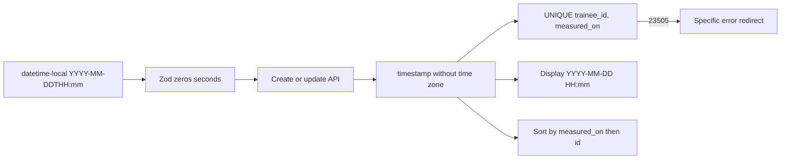

# Add time of day to measured_on

## Overview

A trainee records a measurement with a date and a minute. `created_at` stays the insert timestamp. A second row for the same trainee at the same minute is refused. This is S-22 / MS-15 ([issue #71](https://github.com/gmaszkiewicz/training-manager/issues/71)).

## Current State Analysis

`measured_on` is a calendar date end to end: Postgres `date` in [supabase/migrations/20260928043200_trainee_measurements.sql](supabase/migrations/20260928043200_trainee_measurements.sql), Zod `YYYY-MM-DD` in [src/lib/measurement-input.ts](src/lib/measurement-input.ts), and `type="date"` in [src/components/measurements/MeasurementForm.tsx](src/components/measurements/MeasurementForm.tsx). The list prints that string as "Date".

`created_at` is `timestamptz default now()` on insert. [src/lib/services/measurements.ts](src/lib/services/measurements.ts) sets `created_at: new Date().toISOString()` on every update. Same-calendar-day rows are allowed. [src/lib/measurement-deltas.ts](src/lib/measurement-deltas.ts) orders by `measured_on`, then `created_at`, then `id`, so a note-only save can change which entry is "previous."

There is a non-unique index `measurements_trainee_id_measured_on_created_at_idx` and no unique constraint. Database errors, including a future unique violation, collapse to "Could not save the measurement." The only `23505` handling in the app is the silent race recovery in `src/lib/services/ensure-profile.ts`.

The server rejects a date after UTC today plus one day. The form's `max` is the browser's local today, which is stricter than that ceiling.

## Desired End State

The trainee picks one date-and-time value. The journal and the trainer list show that same clock (`YYYY-MM-DD HH:mm`). Two measurements for one trainee cannot share that minute. Editing a note does not change `created_at` and does not change which entry the arrow compares against. Entries on the same calendar day with different minutes compare in clock order.

Verify with `npm test`, `npm run migration-check`, and `npm run smoke`, plus one create, one same-minute rejection, and one note edit in the browser.

### Key Discoveries:

- One schema, `createMeasurementInputSchema`, gates the island and both API routes. Client and server must accept the same minute string.
- Migrations apply on hosted Supabase before the new Worker. A `date` literal still casts into `timestamp without time zone` as midnight.
- `npm run db:types` regenerates [src/db/database.types.ts](src/db/database.types.ts). PostgREST still types the column as `string`.
- Playwright seed does not post `measured_on`. Smoke and [src/lib/measurement-input.test.ts](src/lib/measurement-input.test.ts) do.

## What We're NOT Doing

- Storing `timestamptz`, converting for the viewer's timezone, or sending a browser offset.
- Recording seconds, or allowing two measurements in the same minute.
- A pre-insert lookup. The unique index is the only duplicate check.
- Rewriting `created_at` on edit, or sorting by `created_at`.
- Ordering deltas by calendar date while ignoring the clock.
- A second release or a parallel column. One migration in this change.
- The nice-to-have date filter (FR-009).
- Changing numeric delta math (tenths, up/down, oldest entry has no delta).

## Implementation Approach

Keep a wall clock in `timestamp without time zone`, truncated to the minute, with seconds stored as `00`. Uniqueness is `(trainee_id, measured_on)`. Chronological order is `measured_on`, then `id`. The future rule stays on the date portion: that date must not be later than UTC today plus one day.

Historical rows keep their calendar date. The time comes from `created_at` in UTC, truncated to the minute. If that minute is already taken for the trainee, the later row moves one minute later, repeating until the minute is free.

## Critical Implementation Details

- **Backfill must be cascade-safe.** Truncating `created_at` to a minute can collide with a neighbor that already owns the next minute. Assign times per trainee in `(candidate minute, id)` order. Keep the candidate when it is strictly after the previous assigned minute; otherwise use the previous assigned minute plus one minute. A single `row_number()` inside the colliding minute is not enough.
- **Deploy window.** Hosted Postgres updates before the Worker. Until the new Worker is live, the previous app can still post `YYYY-MM-DD`, which stores as midnight. A second same-day insert in that window hits the unique index and the old generic save error. That window is accepted.
- **Wire shape.** Canonical stored value is `YYYY-MM-DDTHH:mm:00` with no offset. PostgREST may return a space instead of `T`, or omit seconds. Form value, list text, and `<time datetime>` must normalize that string. Do not parse it as UTC and do not shift the clock.
- **Form ceiling vs default.** Default for a new entry is the browser's local now, truncated to the minute. `max` is the UTC ceiling date at `23:59` as a naive `datetime-local` string. On edit, `max` is the later of that ceiling and the entry's own minute, so an existing value stays submittable.

## Phase 1: Schema and backfill

### Overview

Change `measured_on` from `date` to `timestamp without time zone`, backfill a minute, and enforce one minute per trainee.

### Changes Required:

#### 1. Migration

**File**: `supabase/migrations/<YYYYMMDDHHmmss>_measured_on_timestamp.sql` (new; do not edit `20260928043200_trainee_measurements.sql`)

**Intent**: Existing dates become minute timestamps without moving the calendar day, and the unique index can be created afterward.

**Contract**: `measured_on` becomes `timestamp without time zone not null`. Candidate minute is `date_trunc('minute', measured_on::timestamp + (created_at AT TIME ZONE 'UTC')::time)`. Then the cascade-safe walk above. Drop `measurements_trainee_id_measured_on_created_at_idx`. Add unique index `measurements_trainee_id_measured_on_key` on `(trainee_id, measured_on)`. No RLS, grant, or `created_at` change.

Worked example: date `2026-09-16` and `created_at` `2026-09-16T08:30:45.000Z` become `2026-09-16 08:30:00`. A second row for that trainee at `08:30` with a higher `id` becomes `2026-09-16 08:31:00`. If `08:31` is already assigned, that row becomes `08:32:00`.

#### 2. Generated types

**File**: [src/db/database.types.ts](src/db/database.types.ts)

**Intent**: The TypeScript row matches the new column.

**Contract**: Regenerate with `npm run db:types` after the local migration applies. `measured_on` stays a `string` on the measurements row.

### Success Criteria:

#### Automated Verification:

- New migration applies on local Supabase and `npm run migration-check` passes. The check's `'2026-01-01'` insert may stay a date literal; Postgres stores it as midnight, and the check asserts weight, not the clock.
- `npm run db:types` completes and `measured_on` on the measurements row is still typed as `string`.

#### Manual Verification:

- Prove the backfill while `measured_on` is still `date`. `npm run migration-check` inserts only after every migration, so it never exercises this cast. Apply every migration except the new file. Insert three rows for one trainee, all with `measured_on` `2026-09-16`: id `00000000-0000-4000-8000-000000000001` with `created_at` `2026-09-16T08:30:10Z`, id `00000000-0000-4000-8000-000000000002` with `created_at` `2026-09-16T08:30:45Z`, and id `00000000-0000-4000-8000-000000000003` with `created_at` `2026-09-16T08:31:00Z`. Apply the new migration. The calendar date stays `2026-09-16`. The clocks are `08:30:00`, `08:31:00`, and `08:32:00` in that id order. Do not ship these rows in a production migration.

**Implementation Note**: After automated verification passes, pause for the manual backfill check before Phase 2.

---

## Phase 2: Validation and save

### Overview

Accept a minute wall clock, stop rewriting `created_at`, and turn a unique violation into a specific message.

### Changes Required:

#### 1. Input schema

**File**: [src/lib/measurement-input.ts](src/lib/measurement-input.ts), [src/lib/measurement-input.test.ts](src/lib/measurement-input.test.ts)

**Intent**: Create and update both accept the `datetime-local` value and persist minute precision. The future rule stays date-based.

**Contract**: `measured_on` accepts `YYYY-MM-DDTHH:mm` and `YYYY-MM-DDTHH:mm:ss`. Output is `YYYY-MM-DDTHH:mm:00` (seconds zeroed, not rounded). A date-only string is invalid. Empty becomes "Date and time are required." Invalid becomes "Date and time must be a valid YYYY-MM-DDTHH:mm value." The date portion is compared to the existing UTC today-plus-one-day ceiling; failure stays "Date must not be later than one day from today."

Boundary: when `now` is `2026-10-06T22:00:00.000Z`, `2026-10-07T23:59` is valid and normalizes to `2026-10-07T23:59:00`. `2026-10-08T00:00` is rejected. `2026-10-06T07:30:45` normalizes to `2026-10-06T07:30:00`.

#### 2. Services and API

**File**: [src/lib/services/measurements.ts](src/lib/services/measurements.ts), [src/pages/api/measurements/index.ts](src/pages/api/measurements/index.ts), [src/pages/api/measurements/[id].ts](src/pages/api/measurements/[id].ts)

**Intent**: Inserts still omit `created_at` so the database default applies. Updates no longer touch `created_at`. A duplicate minute is explained.

**Contract**: `updateMeasurement` does not send `created_at`. `addMeasurement` and `updateMeasurement` return `{ ok: false, reason: "duplicate" }` when `error.code === "23505"`, and `{ ok: false }` for every other failure. Both routes redirect with "A measurement at that date and time already exists." for `reason: "duplicate"`, and keep "Could not save the measurement" otherwise. No select-before-write.

### Success Criteria:

#### Automated Verification:

- `npm test` accepts `2026-10-07T23:59` as `2026-10-07T23:59:00`, rejects `2026-10-08T00:00` with "Date must not be later than one day from today", and rejects a date-only string.
- `npm test` normalizes `2026-10-06T07:30:45` to `2026-10-06T07:30:00`.

#### Manual Verification:

- After creating a measurement and editing its note, `created_at` in the database is unchanged.
- Creating or editing onto a minute this trainee already has shows "A measurement at that date and time already exists."

**Implementation Note**: After automated verification passes, pause for the manual save checks before Phase 3.

---

## Phase 3: Form and list

### Overview

The trainee picks a minute, and both the trainee and a linked trainer read that minute back.

### Changes Required:

#### 1. Form

**File**: [src/components/measurements/MeasurementForm.tsx](src/components/measurements/MeasurementForm.tsx)

**Intent**: Replace the date control with one minute control whose default, max, and submitted value match Phase 2.

**Contract**: Label "Date and time". `type="datetime-local"`, `name="measured_on"`, minute step. Submitted and controlled value is `YYYY-MM-DDTHH:mm` (slice a stored timestamp to 16 characters and use `T`). Create default is local now truncated to the minute. `max` is the UTC ceiling date plus `T23:59`; on edit, the later of that and the entry's own minute. Widen the field inside the existing horizontal row so the full minute is visible. Client submit still uses `createMeasurementInputSchema`.

#### 2. List and samples

**File**: [src/components/measurements/MeasurementList.astro](src/components/measurements/MeasurementList.astro), [src/pages/kitchen-sink/journal.astro](src/pages/kitchen-sink/journal.astro), [src/pages/kitchen-sink/trainer.astro](src/pages/kitchen-sink/trainer.astro), [src/components/kitchen-sink/JournalSinkStates.tsx](src/components/kitchen-sink/JournalSinkStates.tsx)

**Intent**: The list shows the wall clock that was stored, including on the kitchen-sink samples. The journal sink's error mock uses the same date-and-time control and required-message as the real form.

**Contract**: Visible text is `YYYY-MM-DD HH:mm`. The field label and edit/delete aria text use that value. `<time datetime>` is the canonical `YYYY-MM-DDTHH:mm:00`. No timezone conversion. Sample `measured_on` values include a time; `created_at` samples stay ISO instants. `JournalSinkStates` error variant uses `type="datetime-local"`, label "Date and time", and error "Date and time are required".

### Success Criteria:

#### Automated Verification:

- `npm run lint` passes and `npx astro check` passes.

#### Manual Verification:

- The create form shows "Date and time", a `datetime-local` control, and a default of the local minute.
- The trainee list and the trainer list show `YYYY-MM-DD HH:mm` for the same stored value.
- `/kitchen-sink/journal` and `/kitchen-sink/trainer` still render the sample entry with a time.
- The journal sink error state shows a datetime-local control labeled "Date and time" and the error "Date and time are required".

**Implementation Note**: After automated verification passes, pause for the manual UI check before Phase 4.

---

## Phase 4: Comparison and fixtures

### Overview

The arrow follows measurement time. Tests and smoke stop assuming a date-only value or a `created_at` reorder.

### Changes Required:

#### 1. Delta order

**File**: [src/lib/measurement-deltas.ts](src/lib/measurement-deltas.ts), [src/lib/measurement-deltas.test.ts](src/lib/measurement-deltas.test.ts)

**Intent**: Previous entry means the previous remaining measurement time. `created_at` is not an order key.

**Contract**: `compareEntries` orders by `measured_on`, then `id`. Same calendar day with different minutes is allowed and follows the clock. `id` is only the tie-break when `measured_on` is equal.

Worked order: `2026-10-06T07:00:00`, then `2026-10-06T19:00:00`, then `2026-10-07T08:00:00`. Two rows with the same `measured_on` still order by `id`. Retire tests that order same-date rows by `created_at`, including the note-only reorder cases. Replace them with different minutes on one day, plus one equal-timestamp `id` tie-break.

#### 2. Smoke fixtures

**File**: [scripts/smoke.mjs](scripts/smoke.mjs)

**Intent**: Smoke posts values the new schema accepts, and the arrow follows time.

**Contract**: Measurement creates and edits send `YYYY-MM-DDTHH:mm` (seconds optional; the server zeros them). Two creates on one calendar day at different minutes produce deltas in clock order. The future rejection still uses a date after the UTC ceiling, expressed as `YYYY-MM-DDT00:00`. An edit that changes only the note does not change which entry is previous.

### Success Criteria:

#### Automated Verification:

- `npm test` orders `2026-10-06T07:00:00` before `2026-10-06T19:00:00` before `2026-10-07T08:00:00`, and breaks an equal `measured_on` by `id`.
- `npm test` no longer contains a case whose expected order depends on `created_at`.

#### Manual Verification:

- `npm run smoke` against a running server: two times on the same day arrow in clock order, and a note-only edit leaves that arrow in place.

**Implementation Note**: After automated verification passes, pause for the smoke run before treating the change as implemented.

---

## Testing Strategy

### Unit Tests:

- Schema boundaries: ceiling date at `23:59` allowed, next date at `00:00` rejected, seconds truncated, date-only rejected.
- Delta order by measurement time, `id` tie-break, no `created_at` sort.

### Integration Tests:

- `npm run migration-check` for the type change and a preserved weight row.
- `npm run smoke` for create, same-day times, note edit, and the future rejection.

### Manual Testing Steps:

1. Create a measurement at a chosen minute and confirm the list shows that clock.
2. Create another at the same minute and confirm the specific error.
3. Create another on the same day at a later minute and confirm the arrow points at the earlier minute.
4. Edit a note and confirm `created_at` and the arrow stay put.
5. Open the same trainee as a trainer and confirm the same clock is shown.

## Performance Considerations

The unique index on `(trainee_id, measured_on)` replaces the old three-column index. List size stays the trainee's own rows, sorted in memory. No caching change.

## Migration Notes

Apply the new migration only. Do not rewrite the original create-table migration. Backfill is in that new file, before the unique index. Rollback of a shipped migration is a later migration, not an edit of this file. The previous Worker tolerates the new column only for a single midnight insert per calendar day.

## References

- Research: `context/changes/measured-on-with-time/research.md`
- Roadmap: S-22 in `context/foundation/roadmap.md`
- Issue: https://github.com/gmaszkiewicz/training-manager/issues/71
- Prior date-only decision: `context/archive/2026-09-27-trainee-measurement-delta/plan-brief.md`
- Prior `created_at` rewrite: `context/archive/2026-10-02-edit-measurement-entry/plan.md`
- Unique-violation pattern to adapt, not copy as success: `src/lib/services/ensure-profile.ts`

## Progress

> Convention: `- [ ]` pending, `- [x]` done. Append ` — <commit sha>` when a step lands. Do not rename step titles. See `references/progress-format.md`.

### Phase 1: Schema and backfill

#### Automated

- [x] 1.1 New migration applies on local Supabase and `npm run migration-check` passes
- [x] 1.2 `npm run db:types` completes and `measured_on` on the measurements row is still typed as `string`

#### Manual

- [x] 1.3 Same-day history keeps its calendar date, uses the UTC creation minute, and nudges colliding later ids until unique — daa4e23

### Phase 2: Validation and save

#### Automated

- [x] 2.1 `npm test` accepts `2026-10-07T23:59` as `2026-10-07T23:59:00`, rejects `2026-10-08T00:00` with the existing ceiling message, and rejects a date-only string
- [x] 2.2 `npm test` normalizes `2026-10-06T07:30:45` to `2026-10-06T07:30:00`

#### Manual

- [x] 2.3 Editing a note leaves `created_at` unchanged — daa4e23
- [x] 2.4 A duplicate minute shows "A measurement at that date and time already exists." — daa4e23

### Phase 3: Form and list

#### Automated

- [x] 3.1 `npm run lint` passes and `npx astro check` passes

#### Manual

- [x] 3.2 Create form is a datetime-local "Date and time" control defaulting to the local minute — daa4e23
- [x] 3.3 Trainee and trainer lists show `YYYY-MM-DD HH:mm` for the stored wall clock — daa4e23
- [x] 3.4 Kitchen-sink journal and trainer still render the sample entry with a time — daa4e23
- [x] 3.5 The journal sink error state shows a datetime-local control labeled "Date and time" and the error "Date and time are required" — daa4e23

### Phase 4: Comparison and fixtures

#### Automated

- [x] 4.1 `npm test` orders `2026-10-06T07:00:00` before `2026-10-06T19:00:00` before `2026-10-07T08:00:00`, and breaks an equal `measured_on` by `id`
- [x] 4.2 `npm test` no longer contains a case whose expected order depends on `created_at`

#### Manual

- [x] 4.3 `npm run smoke` shows same-day arrows in clock order, and a note-only edit leaves that arrow in place
